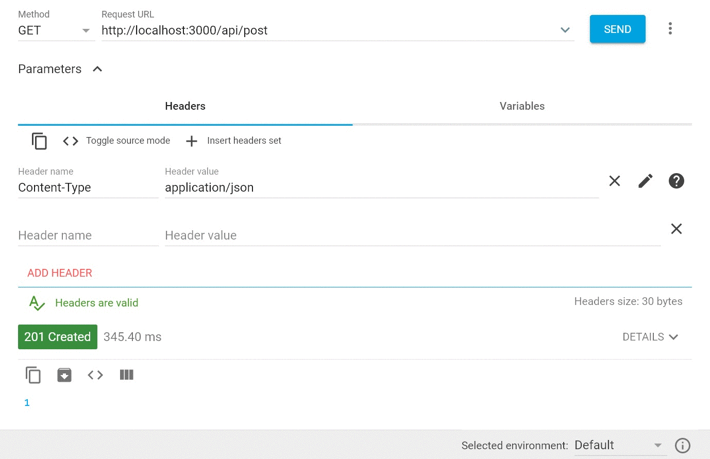
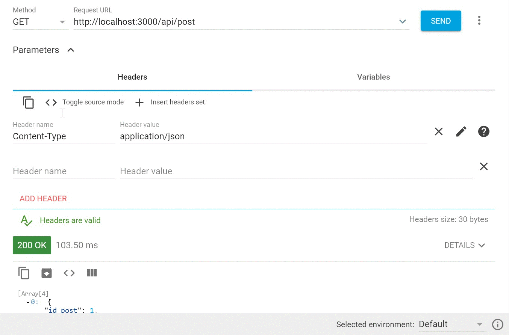
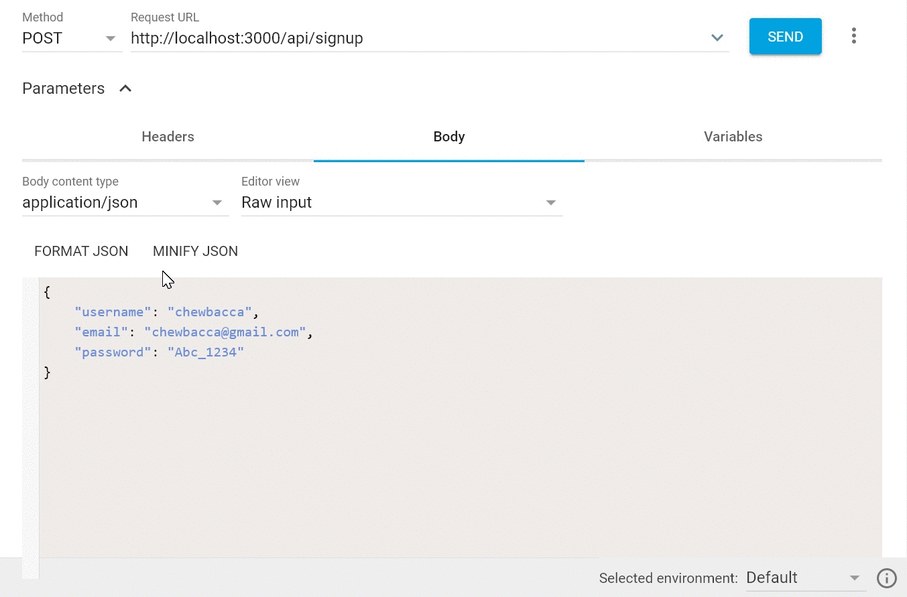
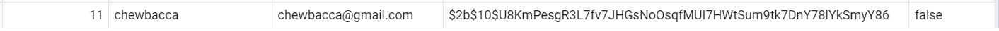
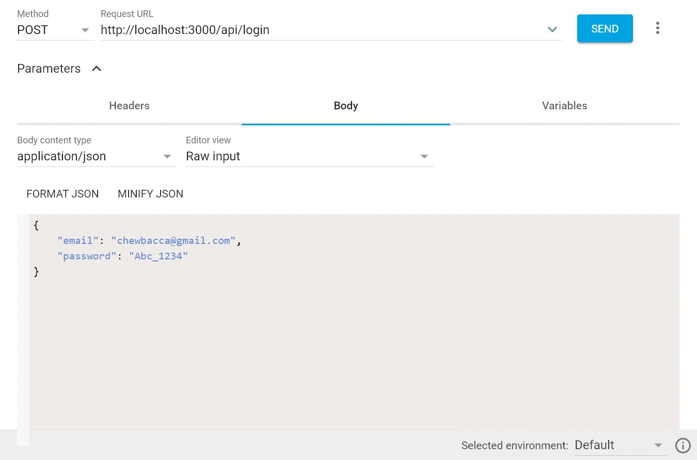
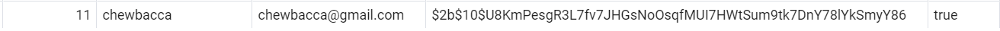
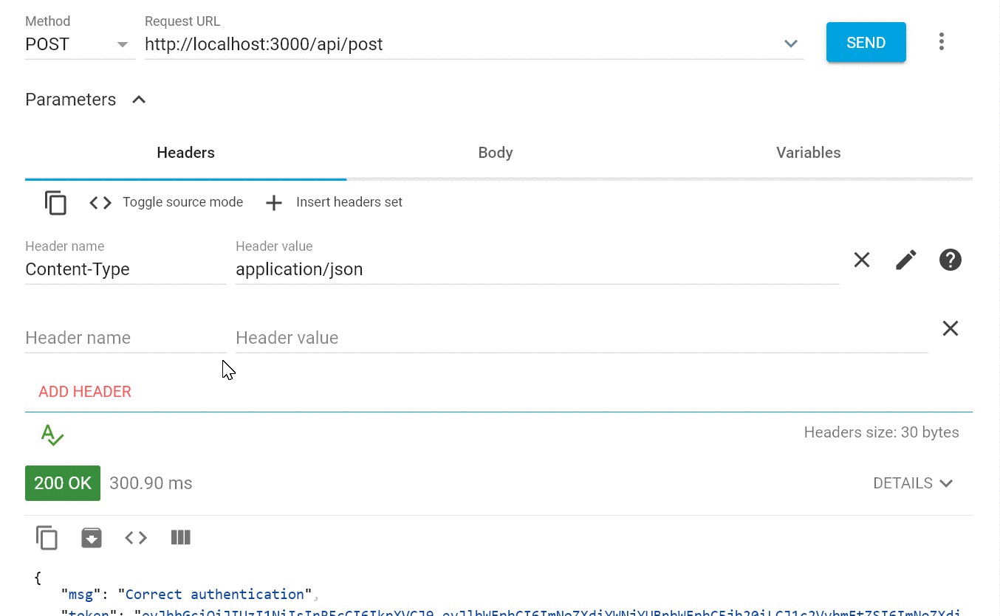
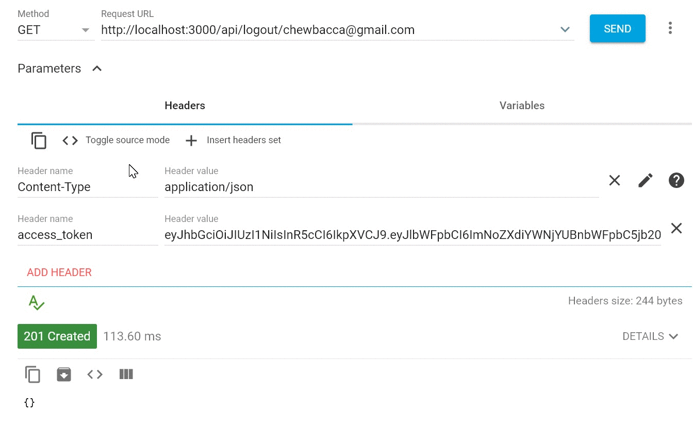
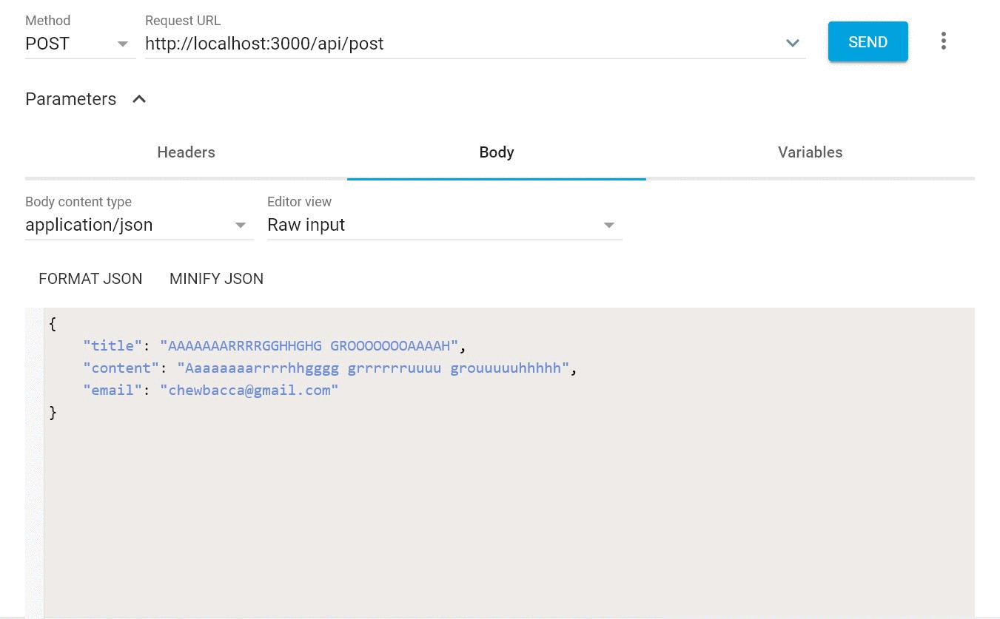

# API REST PostgreSQL

API REST of user login/sign-up, logout and view and edit a list of products with with Node.js, Express and PostgreSQL using jwt(jsonwebtoken) authentication

## Libraries

- Express
- Bcrypt
- Dotenv
- Jsonwebtoken
- Mongoose
- Pg

## Installation

Install dependencies and devdependencies
```javascript
npm i 
```

Start project in localhost:3000
```javascript
npm start
```

## SQL Queries

First of all, you need to create the tables in your PostgreSQL database

```javascript
CREATE TABLE users
(id_user serial NOT NULL PRIMARY KEY,
 username VARCHAR(50) NOT NULL,
 email VARCHAR(255) UNIQUE NOT NULL,
 password VARCHAR(200) NOT NULL,
 logged BOOLEAN NOT NULL
);
```

```javascript
CREATE TABLE posts
(
id_post serial NOT NULL PRIMARY KEY,
title VARCHAR(50) NOT NULL,
content VARCHAR(140) NOT NULL,
date DATE default current_date,
id_user INT NOT NULL,
FOREIGN KEY (id_user) REFERENCES users (id_user)
)
```

## Dotenv variables

```javascript
DB_USER
DB_PASSWORD
DB_HOST
DB_PORT
DB_DATABASE
ULTRA_SECRET_KEY
```

## How to use it

Go to your Rest Client (I use Advanced Rest Client) to make your requests.

First of all we will get the posts that we have in our database



Then, if we add an email in the URL, we can select posts by authors



Now, we are going to create a user profile to upload posts.



As you can see in your database, the create profile has a column called logged with the false value by default.



Now, make a post request to log in with the new account



The logged value will change in your database



Paste your token in the "access_token" header, we need the logged value true and our token to send posts



Then wi will make a GET request to logout our user, this only will change the logged value to false, so our token isn't value anymore and the API REST will send us the message:

```javascript
{ msg: 'Token deleted' }
```



If we try to send a new post, the API REST will send the message:

```javascript
{ msg: 'Invalid token' }
```


